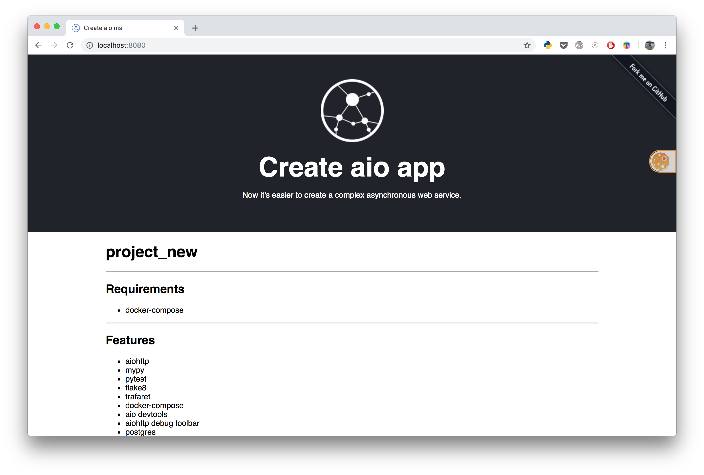

# Create aio app
[](https://travis-ci.com/aio-libs/create-aio-app)
[](https://opensource.org/licenses/MIT)
[](https://gitter.im/aio-libs/Lobby)

The tool that helps quickly create a basis for the microservice on aiohttp and prepare the development environment.



## Installation

Requires python3.5 - python3.7 and docker-compose

```bash
pip install create-aio-app
```

## Usage

```bash

create-aio-app my_project
```

or if u wanna use manual mode, enter only command below

```bash
create-aio-app
``` 

After that it will create new directory `my_project`.

```bash
cd my_project

make run # start your project
```

and open in your browser `http://localhost:8080/`

## Features

- aiohttp
- mypy
- pytest
- flake8
- trafaret
- docker-compose
- aio devtools
- aiohttp debug toolbar
- postgres
- alembic
- aiopg
- sqlAlchemy


## Options

`--without-postgres` - remove postgres and all helpful libs connected with db from template

`--redis` - add redis to the template


## License

Create aio App is open source software <a href="https://github.com/aio-libs/create-aio-app/blob/master/LICENSE">licensed as MIT</a>. 
